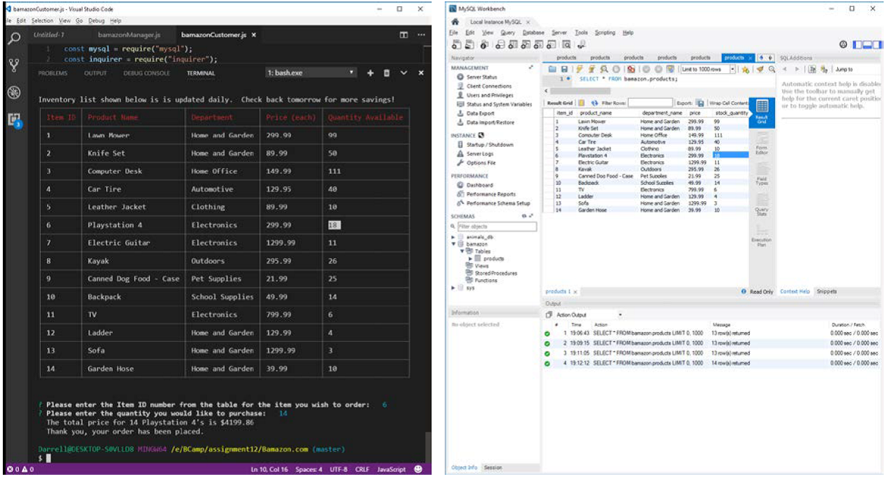
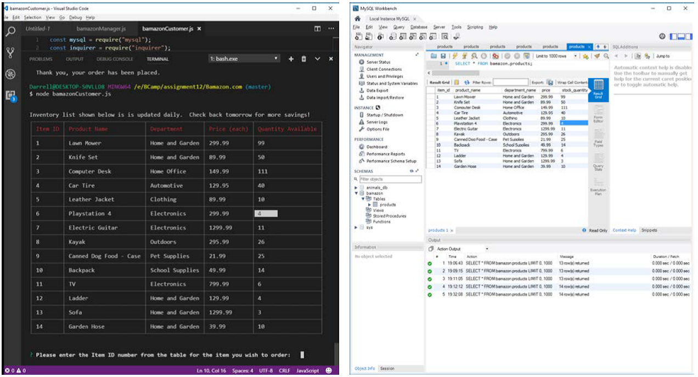

### Bamazon.com - An online store inventory management system.
***

- Author:  Darrell Freeman
- Date:  05/23/17
- Tools Used:  Node.js, MySQL, Javascript, NPM's (inquirer, mysql, cli-table)

Bamazon.com is a an interactive shopping app that uses Node.js and MySQL to package the customer shopping experience together with an inventory management system in one place.

#### Bamazon Customer Storefront - intialized using the command `node bamazonCustomer.js` at the terminal.
***

Customers can view the current inventory and select items that they wish to purchase.  An order is completed for any purchases made if sufficient stock exists .  The user is notified if there is not enough of an item in stock to complete the order, and is prompted to enter a valid purchase quantity.  If an order is completed, the number of items ordered is removed from and reflected after another inventory check.  This is also confirmed within the MySQL database. 

&nbsp;&nbsp;&nbsp;&nbsp;&nbsp;&nbsp;&nbsp;&nbsp;&nbsp;&nbsp;&nbsp;&nbsp;&nbsp;&nbsp;&nbsp;&nbsp;&nbsp;&nbsp;&nbsp;&nbsp;&nbsp;&nbsp;&nbsp;&nbsp;&nbsp;&nbsp;&nbsp;&nbsp;&nbsp;&nbsp;&nbsp;&nbsp;  Initial Customer View
&nbsp;&nbsp;&nbsp;&nbsp;&nbsp;&nbsp;&nbsp;&nbsp;&nbsp;&nbsp;&nbsp;&nbsp;&nbsp;&nbsp;&nbsp;&nbsp;&nbsp;&nbsp;&nbsp;&nbsp;&nbsp;&nbsp;&nbsp;&nbsp;&nbsp;&nbsp;&nbsp;&nbsp;&nbsp;&nbsp;&nbsp;&nbsp;&nbsp;&nbsp;&nbsp;&nbsp;&nbsp;&nbsp;&nbsp;&nbsp;&nbsp;&nbsp;&nbsp;&nbsp;&nbsp;&nbsp;&nbsp;&nbsp;&nbsp;&nbsp;&nbsp;&nbsp;&nbsp;&nbsp;&nbsp;&nbsp;&nbsp;&nbsp;&nbsp;&nbsp;&nbsp;&nbsp;&nbsp;&nbsp;&nbsp;&nbsp;&nbsp;&nbsp;    MySQL Source Database

In this example, we are going to place an order for 14 Playstation 4's.  So we simply enter the ID number of the item (6) that we are ordering, and then how many we want (14.  We're having a party and need stations).

And after our order has been placed, we re-run the program and refresh the MySQL database.  Both reflect correctly that we have 4 units left over.  

#### Bamazon Inventory Management -(Manager Level) - intialized using the command `node bamazonManager.js` at the terminal.
***
